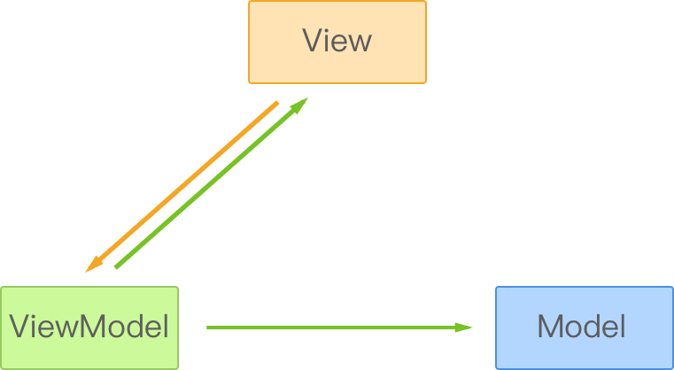
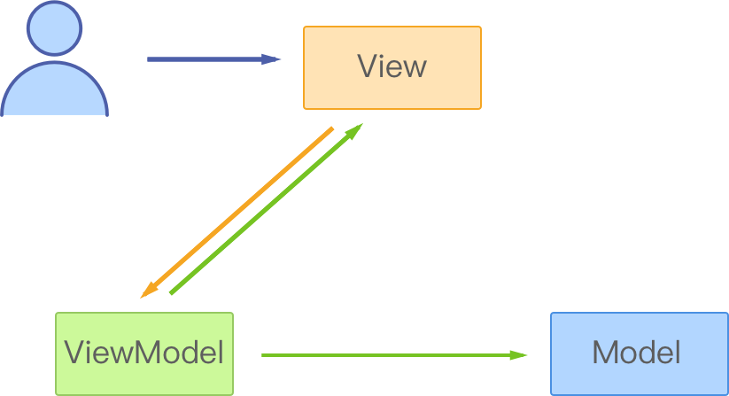
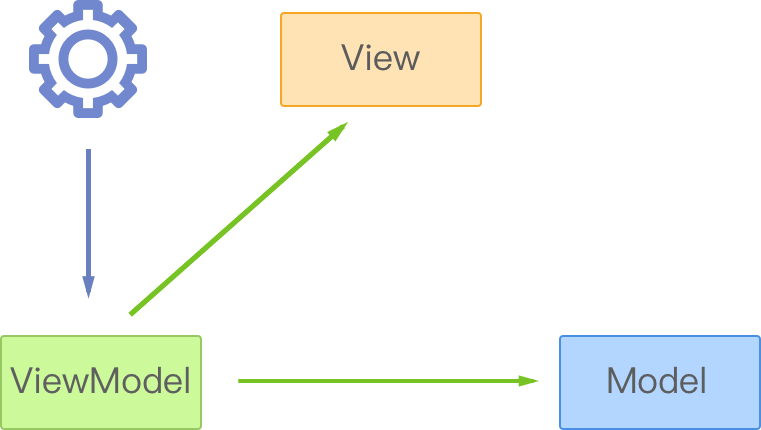
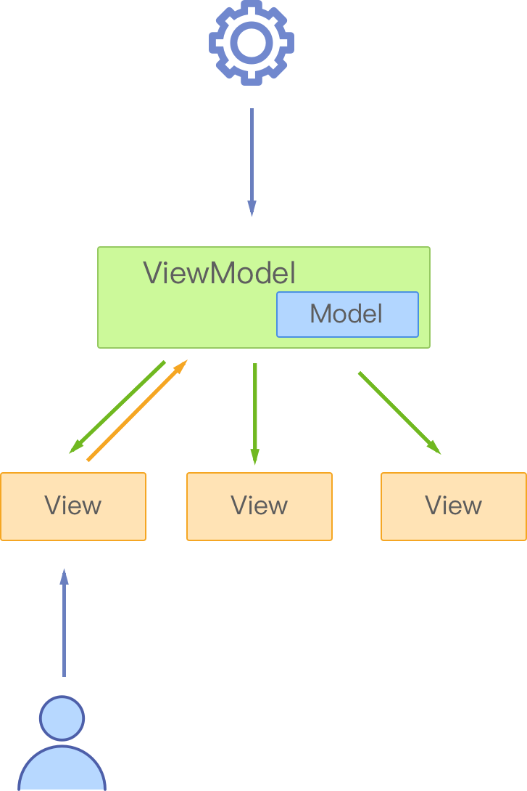

## Godot MVC 图解

Godot MVC是MVC模式的一种实现方式，用于Godot游戏引擎的MVC框架，主要作用是帮助我们实现游戏界面开发过程中的业务逻辑和视图的分离。

图中的View部分是游戏界面中用于显示的对象，一般是Godot中的Node对象；Model是用于交给View显示的数据模型；ViewModel是用来控制View和Model更新的控制器。在GodotMVC中View与Model不发生直接联系，ViewModel负责控制视图和数据的更新并处理业务逻辑。

该MVC框架实现区别于MVP或MVVM,，数据的修改必须通过ViewModel进行，**直接对数据模型的操作不会对视图产生影响**。该框中View和Model都非常薄，不部署任何业务逻辑，业务逻辑全部部署在ViewModel这个控制器中。

### 视图驱动的更新流程

一次用户通过对视图交互来修改数据模型的流程如下图所示

View接收到事件，根据需要来通过ViewModel更新数据，ViewModel把View中传过来的新数据更新到Model，然后再把更新后的Model数据传递给View，View接收到新的数据模型进行显示更新。

### 数据驱动的更新流程

一次通过业务逻辑中对数据的修改来更新数据模型和视图的流程如下图所示

业务逻辑中通过ViewModel修改它所绑定的数据模型(唯一一个)和所有绑定的视图(可以是多个)。此过程中ViewModel更新Model后将其传递给所有绑定的视图来更新视图的显示。

### GodotMVC框架的结构图

